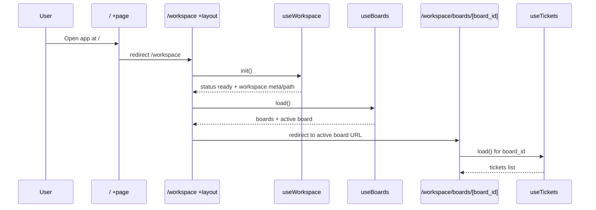

# Worklog Dataflow Anatomy

This document explains how data moves through the app after the route/layout split into workspace-scoped navigation and board-scoped content.

## 1. Big Picture

The application follows this pipeline:

1. UI events in Svelte components
2. Route/layout orchestration
3. Shared hooks (workspace + boards) and board-scoped hook (tickets)
4. Repository layer
5. SQLite via Tauri SQL plugin

Mermaid map:

```mermaid
flowchart LR
    A[UI Components] --> B[Route/Layout Controllers]
    B --> C[Hooks]
    C --> D[Repositories]
    D --> E[(SQLite .worklog/worklog.db)]

    C --> C1[useWorkspace]
    C --> C2[useBoards]
    C --> C3[useTickets]

    B --> B1[src/routes/workspace/+layout.svelte]
    B --> B2[src/routes/workspace/boards/[board_id]/+page.svelte]
```

## 2. Route and Layout Ownership

### Root shell

- `src/routes/+layout.svelte`
- Owns global app shell and mounts `AppToolbar` once.
- Renders children inside `.app-shell-content`.

### Root entry route

- `src/routes/+page.svelte`
- Compatibility entry route only.
- Immediately redirects to `/workspace`.

### Workspace layout (shared state boundary)

- `src/routes/workspace/+layout.svelte`
- Creates and owns:
  - `workspace = useWorkspace()`
  - `boardsApi = useBoards(() => workspace.path)`
- Publishes both via typed context:
  - `setWorkspaceShellContext({ workspace, boardsApi })`
- Handles workspace lifecycle states:
  - `idle`, `loading`, `no_workspace`, `error`, `ready`
- Renders persistent sidebar (`KanbanSidebar`) when ready.

### Workspace index route

- `src/routes/workspace/+page.svelte`
- Redirect route only.
- Reads `boardsApi.active?.id` from context and redirects to `/workspace/boards/[board_id]`.

### Board route (board-scoped data)

- `src/routes/workspace/boards/[board_id]/+page.svelte`
- Reads context (`workspace`, `boardsApi`) from workspace layout.
- Instantiates board-scoped tickets hook:
  - `useTickets(() => workspace.path, () => data.board_id)`
- Synchronizes `boardsApi.active` with URL `board_id`.
- Handles invalid board IDs with fallback/redirect behavior.

## 3. Context Boundary

Context module:

- `src/lib/hooks/workspace-shell-context.ts`

Exports:

- `setWorkspaceShellContext`
- `getWorkspaceShellContext`
- Typed shape:
  - `workspace: ReturnType<typeof useWorkspace>`
  - `boardsApi: ReturnType<typeof useBoards>`

Meaning:

- Workspace and board state is shared by all routes under `/workspace`.
- Tickets are intentionally not in context yet; they remain board-page scoped.

## 4. Hook Layer Anatomy

## 4.1 `useWorkspace`

- File: `src/lib/hooks/workspace.svelte.ts`
- Module state (shared singleton):
  - `_path`, `_meta`, `_status`, `_error`
- Responsibilities:
  - Restore saved workspace path from `localStorage`
  - Open workspace DB and run migrations
  - Initialize/read `workspace_meta`
  - Pick workspace via Tauri dialog
  - Close DB and clear saved path

Notable side effects:

- `localStorage` read/write for `last_workspace_path`
- Dynamic import of `@tauri-apps/plugin-dialog`
- DB open/migration via `getDb` + `runMigrations`

## 4.2 `useBoards`

- File: `src/lib/hooks/boards.svelte.ts`
- Module state:
  - `_boards`, `_active`, `_loading`
- Input contract:
  - getter function `getWorkspacePath()` to avoid stale captures
- Responsibilities:
  - `load`, `create`, `rename`, `remove`, `setActive`
  - Auto-select first board when no active board exists

## 4.3 `useTickets`

- File: `src/lib/hooks/tickets.svelte.ts`
- Module state:
  - `_tickets`, `_loading`
- Input contract:
  - `getWorkspacePath()`
  - `getBoardId()`
- Responsibilities:
  - `load`, `create`, `update`, `remove`
  - Clear tickets when workspace or board is missing

Board page adds a ticket-scope guard (`workspacePath:boardId`) to prevent stale load behavior across workspace switches.

## 5. Component Dataflow

### Sidebar branch (workspace scope)

- `KanbanSidebar` receives data/callbacks from workspace layout:
  - `workspaceName`
  - `boards`
  - `activeBoardId`
  - `onOpenBoard`, `onUpdateBoard`, `onDeleteBoard`
- Sidebar emits user intents through callbacks.
- Workspace layout maps intents to hooks + navigation.

### Board content branch (board scope)

- `KanbanBoard` is now sidebar-free and receives:
  - `title`, `columns`, `tasks`
  - `onCreateTicket`, `onUpdateTicket`, `onDrop`
- `KanbanBoard` manages only local UI state:
  - inline create status
  - selected ticket panel state

## 6. Persistence Boundary

Entry points:

- `src/lib/db/index.ts` exports repositories and DB connection helpers.
- `src/lib/db/connection.ts`:
  - Opens/rotates singleton DB per workspace path
  - Ensures `${workspacePath}/.worklog` exists
  - Opens SQLite DB at `${workspacePath}/.worklog/worklog.db`

Repositories:

- `workspace.repo.ts`: `workspace_meta` init/read/update
- `board.repo.ts`: board CRUD
- `ticket.repo.ts`: ticket CRUD + JSON serialization for `labels` and `comments`

Domain source of truth:

- `src/lib/components/app/types.ts`
- Key conventions:
  - snake_case fields (`board_id`, `created_at`, `updated_at`)
  - ticket status literals: `backlog | todo | in_progress | done`

## 7. Request/Mutation Walkthroughs

### A. App boot -> active board screen



### B. Board switch from sidebar

1. Sidebar click -> `onOpenBoard(boardId)`
2. Workspace layout:
   - `boardsApi.setActive(board)`
   - `goto(/workspace/boards/[boardId])`
3. Board route reacts to new `data.board_id`
4. Tickets hook reloads board tickets
5. `KanbanBoard` rerenders from new `tasks`

### C. Drag-and-drop ticket status update

1. `KanbanBoard` emits `onDrop`
2. Board route validates target status
3. Board route calls `ticketsApi.update(ticketId, { status })`
4. `useTickets.update` writes through `TicketRepo.updateTicket`
5. `_tickets` state is replaced with updated item
6. UI updates via reactivity

## 8. Why This Split Works

- Shared concerns moved to workspace layout:
  - workspace lifecycle
  - board list and board selection
  - sidebar persistence
- Board page is now focused:
  - board URL synchronization
  - ticket loading/mutations
- Component hierarchy is cleaner:
  - `KanbanSidebar` = navigation surface
  - `KanbanBoard` = board content + local UI state

## 9. Current Tradeoffs and Next Step

Current tradeoff:

- `useWorkspace`, `useBoards`, and `useTickets` use module-level singleton state.
- This is fine in current SPA/Tauri usage, but it means state is shared globally in the running app instance.

Likely next improvement:

- Move selected ticket/panel state into a small board-content context to reduce callback wiring between `KanbanBoard`, columns, cards, and panel.

---

If you update any route or hook ownership, update this file in the same commit so architecture docs stay in sync with implementation.
